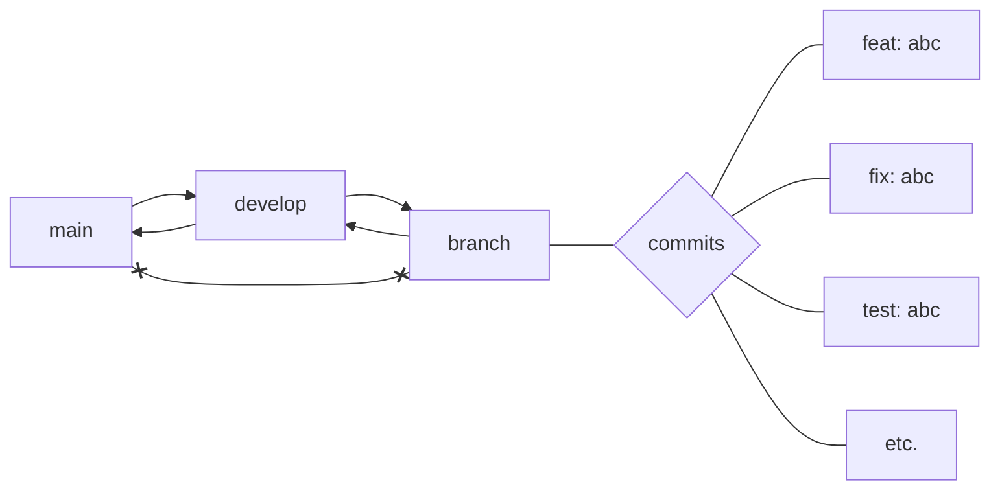

# NatLuk Front <!-- omit in toc -->

Project is bootstrapped thanks to [Vite](https://vitejs.dev/guide/).

- [Quick start](#quick-start)
- [Dev Stack](#dev-stack)
- [Git Flow](#git-flow)
  - [Principles](#principles)
  - [Legend](#legend)
- [Code quality](#code-quality)
- [Structure](#structure)
  - [Source folders](#source-folders)
  - [Components](#components)
  - [Styles](#styles)

---

## Quick start

We recommend to use [yarn](https://classic.yarnpkg.com/lang/en/docs/install/) as a package manager.

1. Clone: `git clone git@gitlab.com:natluk/natluk.git`;
2. Install yarn: `npm install --global yarn`;
3. Install dependencies, in the root folder `yarn`;
4. Start development: `yarn dev`;
5. Have fun 👾!

## Dev Stack

- **Base libs.:**
  - [React](https://reactjs.org/), React Dom,
  - [React Router](https://reactrouter.com/docs/en/v6),
  - [Redux Toolkit](https://redux-toolkit.js.org/introduction/getting-started)
- **Other libs.:** [Axios](https://axios-http.com/) (API calls)
- **Styles:** SCSS, Bootstrap Grid, Include Media
- **Linters:** [ESLint](https://eslint.org/), [Prettier](https://prettier.io/)
- **CI/CD:** Docker, ... <!-- ToDo: actions, tests -->

## Git Flow



### Principles

- Merge only develop/release to main.
- Create your branch from develop.
- Follow the commit naming convention.

### Legend

| Prefix | Description                                                   |
| ------ | ------------------------------------------------------------- |
| feat   | A new feature                                                 |
| fix    | A bug fix                                                     |
| docs   | Documentation only changes                                    |
| style  | Changes that do not affect the meaning of the code            |
| style  | White-space, formatting, missing semi-colons, etc.            |
| ref    | A code change that neither fixes a bug nor adds a feature     |
| perf   | A code change that improves performance                       |
| test   | Adding missing tests or correcting existing tests             |
| build  | Changes that affect the build system or external dependencies |
| ci     | Changes to our CI configuration files and scripts             |
| chore  | Other changes that don't modify src or test files             |
| revert | Reverts a previous commit                                     |

## Code quality

<!-- ToDo: how to setup linter & prettier -->

## Structure

### Source folders

<!-- ToDo: add state management -->

| Folder     | Description                          |
| ---------- | ------------------------------------ |
| Assets     | Images, fonts, etc.                  |
| Components | Whole components from design system. |
| Data       | JSON, XML, CSV files, etc.           |
| Pages      | Sub pages.                           |
| Routers    | Page routing.                        |

### Components

<!-- ToDo: description + links -->

The folder contains UI components form NatLuk Design System. The approach to developing components is [Atomic Design Methodology](https://atomicdesign.bradfrost.com/table-of-contents/).

### Styles

<!-- ToDo: more description -->

There are main styles and styles per component.

1. Main styles

    ```txt
    sass/
    |
    |– utils/
    |   |– _variables.scss    // Sass Variables
    |   |– _functions.scss    // Sass Functions
    |   |– _mixins.scss       // Sass Mixins
    |
    |– layout/
    |   |– _common.scss       // Commons
    |   |– _fonts.scss        // Font faces
    |   |– _grid.scss         // Grid system
    |   |– _typography.scss   // Base project typography
    |
    |– themes/
    |   |– _light.scss        // Default theme colors
    |
    |
    `–config.scss             // Config file
    `–main.scss               // Main Sass file
    ```

2. Per component

<!-- 
  ToDo: discuss the dev environment.
  - Mono-Repo vs.Multi-Repo;
  - NPM registry;
  - CI / CD;
-->
